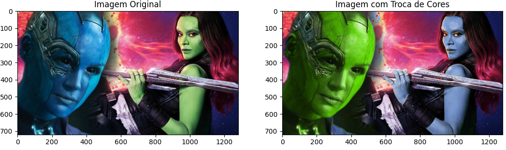

# Descrições para executar o laboratório

## 1. Certifique-se de ter o python instalado
    O lab1 foi implementado puramente no python versão 3

## 2. Ative o ambiente
```
$ source venv/bin/activate
```

Lembre que toda vez que sair do ambiente é preciso ativar denovo

## 3. Dependências
para facilitar, o projeto conta com um arquivo que contém todas as
dependências necessarias para rodar o projeto. O arquivo chama-se
__requirements__
### 3.1. instalando as dependencias
```
$ pip3 install -r requirements
```
uma vez que as dependências foram instaladas não a mais necessidade do passo 3.1, basta ativar o ambiente no passo 2
## 4. Executando o projeto
```
$ python3 xchg.py gamora_nebula.jpg
```
## 5. Resultado
Após executado a saida esperada será a troca de pele entre gamora e a nebulosa. Para realizar tal trabalho foi utilizado o parametro hue(h) do esquema de cores HSV.

